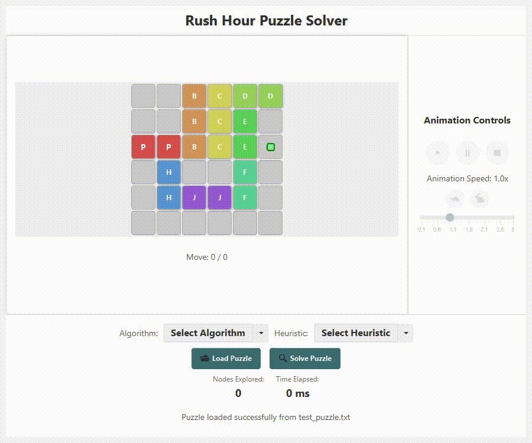

<div align="center"> 
  <h1> Rush Hour Puzzle Solver </h1>
  <h3> Tugas Kecil 3 IF2211 Strategi Algoritma </h3>




</div>

## Program Description

Program ini adalah **penyelesai puzzle Rush Hour berbasis algoritma pathfinding dengan GUI JavaFX**. Pengguna dapat memuat konfigurasi puzzle dari file `.txt` dan memilih algoritma pencarian yang tersedia untuk menemukan solusi minimal dalam jumlah langkah.

Puzzle Rush Hour merupakan permainan logika grid 6x6 yang mengharuskan pemain untuk mengeluarkan mobil utama (berlabel `P`) dari kemacetan dengan menggeser kendaraan lain secara horizontal atau vertikal, sesuai orientasinya.

---

### Input

- File teks `.txt` berformat:
  - Baris pertama: ukuran papan (contoh: `6 6`)
  - Baris kedua: jumlah kendaraan
  - Baris selanjutnya: grid puzzle berisi karakter mobil (P untuk primary car), `.` untuk kosong, dan `K` untuk pintu keluar

Contoh file `.txt` input:

```bash
6 6
8
..BCDD
..BCE.
PPBCE.K
.H..F.
.HJJF.
......
```

- Algoritma pathfinding yang ingin digunakan
  - `Uniform Cost Search (UCS)`
  - `Greedy Best First Search`
  - `A* Search`
  - `Fringe Search`
- Heuristik yang digunakan
  - `blockingCars`: menghitung jumlah kendaraan yang menghalangi jalan keluar
  - `exitDistance`: menghitung jarak mobil utama ke pintu keluar
- File teks `.txt` berformat:

---

### Output

- Solusi ditampilkan sebagai animasi gerakan tiap kendaraan
- Menampilkan informasi:
  - Banyak node yang dieksplorasi
  - Waktu komputasi (ms)
  - Jumlah langkah solusi
- Seluruh visualisasi ditampilkan dalam JavaFX GUI interaktif

---

### Fitur Utama

- GUI interaktif menggunakan **JavaFX**
- Mendukung **4 algoritma pencarian** yang dapat dipilih oleh pengguna
- Mendukung **2 heuristik** untuk algoritma informed yang dapat dipilih oleh pengguna
- Kontrol animasi lengkap: **Play, Pause, Stop, Adjust Speed**

---

### Tech Stack

- Bahasa: **Java**
- GUI: **JavaFX**
- Build System: **Maven**
- Platform: **Cross-platform (Windows, Mac, Linux)**

---

## Getting Started: Requirement dan Instalasi

#### 1. Wajib Menggunakan JDK dan Maven

Untuk menjalankan program inip, pastikan sistem kamu telah ter-installed:

- [Java Development Kit (JDK) 17 atau lebih tinggi](https://adoptium.net/en-GB/temurin/releases/)
- [Apache Maven](https://maven.apache.org/download.cgi)

> Pastikan `java -version` dan `mvn -v` berfungsi dari terminal atau command prompt.

---

#### 2. Menjalankan Program

1. Clone repository ini dan masuk ke dalam directory:

```bash
git clone https://github.com/0xNathaniel/Tucil3_13523013_13523040.git
cd Tucil3_13523013_13523040
```

2. Jalankan program dengan Maven:

```bash
mvn clean javafx:run
```

---

## Authors

| Nama                     | NIM      |
| ------------------------ | -------- |
| Nathaniel Jonathan Rusli | 13523013 |
| Kenneth Poenadi          | 13523040 |
